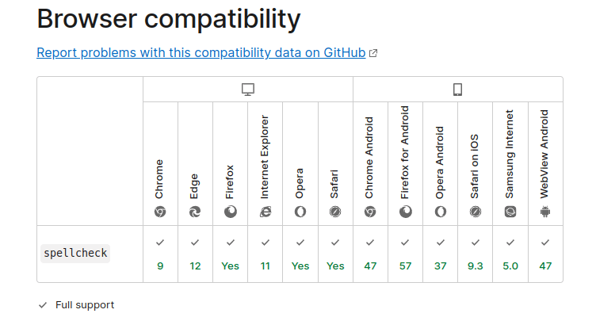

今天要介绍的这些 HTML 技巧，绝对会让你大吃一惊！

## 1. 使用 capture 属性打开设备摄像头

---

正如`input`标签具有`email`、`text`和`password`属性一样，我们也可以通过一些属性打开移动设备的摄像头以捕获图像。

那就是`capture`属性，属性值有两个：

- `user`用于前置摄像头
- `environment`用于后置摄像头

```html
<input type="file" capture="user" accept="image/*" />
```

## 2. 网站自动刷新

---

你可以在`head`标签中将网站设置为定时刷新！

```html
<head>
  <meta http-equiv="refresh" content="10" />
</head>
```

此代码段可以实现每 10 秒刷新一次网站。

## 3. 激活拼写检查

---

你可以使用 HTML 的`spellcheck`属性并将其设置为`true`以激活拼写检查。使用`lang`属性指定待检查的语言。

```html
<input type="text" spellcheck="true" lang="en" />
```

这是一个标准属性，得到了大多数浏览器的支持。



## 4. 指定要上传的文件类型

---

你可以使用`accept`属性在`input`标签中指定允许用户上传的文件类型。

```html
<input type="file" accept=".jpeg,.png" />
```

## 5. 阻止浏览器翻译

---

将`translate`属性设置为`no`会阻止浏览器翻译该内容。如果你不想翻译某个短语或单词，例如 logo、公司或品牌名称，那就可以应用这个属性。

```html
<p translate="no">Brand name</p>
```

## 6. 在 input 标签中输入多个项目

这可以通过`multiple`属性来完成。

```html
<input type="file" multiple />
```

适用于文件和电子邮件。如果是电子邮件，则可以用逗号分隔。

## 7. 为视频创建海报（缩略图）

---

使用`poster`属性，我们可以在视频加载时，或者在用户点击播放按钮之前，显示指定的缩略图。

如果不指定图片，则默认使用视频的第一帧作为缩略图。

```html
<video poster="picture.png"></video>
```

## 8. 点击链接自动下载

---

如果你希望在单击目标资源的链接时下载特定资源，那就添加`download`属性。

```html
<a href="image.png" download></a>
```
