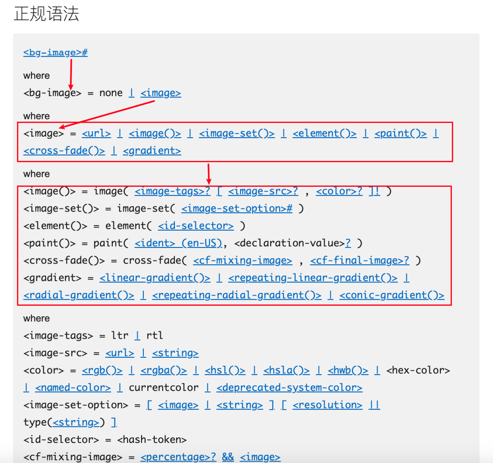
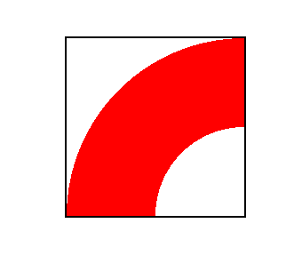
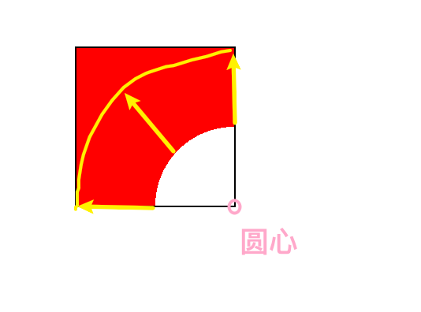
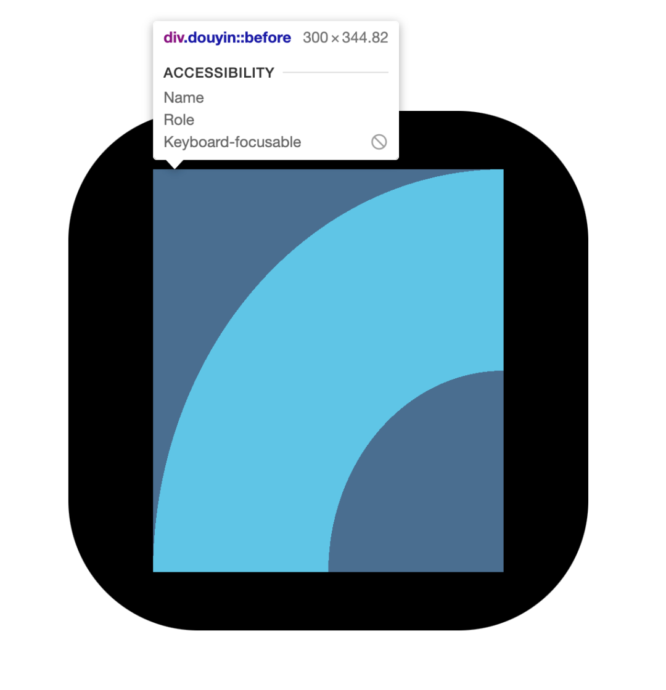

先上结果，最终实现效果如下：


还原度应该还可以吧？

## 抖音 Logo 结构

---

想要用 CSS 来画抖音的 Logo，前提要先了解它的构造，一定是一些几何图形的拼接组合，因为之前很多业界大佬已经扒过抖音的 Logo 的结构了，我就拿来借用一下：


好的，有点复杂，简化一下，其实就是 `4` 个部分


每个颜色划出来的区域代表一个部分，所以最后是：`1/4圆环` + `半圆` + `长条矩形` + `半径略大一些的1/4圆环`

## 制作思路

---

回到本文标题，有人要说我标题党了，这 `logo` 都划分成四个部分了，你怎么用一个标签搞定呢？就算你用 `::before` 和 `::after`，也加上标签本体一共也就三个部分

而且！抖音的 `logo` 是有两层的：


​ 抖音 logo

可以看到，是一个青色的音符和一个红色的音符叠加的

所以！ 这么多元素，你怎么用一个标签完成呢？而且还说带动画，是不是逗我们玩呢？

好了，别急，咱们先捋一下思路哈：

- 先从元素的大方向开始思考：

- - 需要实现一个黑色背景（需要一个标签）
  - 两个音符叠加（"黑色背景"已经是一个标签了，那两个音符只能是两个伪元素）

- 再从元素的小细节着手突破：

- - 需要在一个伪元素中一笔画出整个音符图案（容我思考一下...）

如何在一个伪元素中一笔画出整个音符图案呢？

💡 想到办法了，超级简单，给大家演示一下

```html
<style>
  /* 为了保证文章整洁，省略一些代码... */
  .douyin::before {
    background: url("青色的音符.png");
  }

  .douyin::affter {
    background: url("红色的音符.png");
  }
</style>

<div class="douyin" />
```


别骂了，别骂了，刚刚跟大家开了个小玩笑，正文走起！

我们肯定是要用到 `background` 属性的，不然哪来的色块啊，去扒一下 MDN 文档：


都不用想了，只有一个 `background-image` 有用，那再具体看看：


划重点了！同学们，`background-image` 支持为一个元素设置一个或多个图像，来看一下其支持哪些图像类型：



看了语法，发现基本上 `<image>` 类型支持的都是直接设置图片的，唯独有一个支持渐变函数的，例如：`linear-gradient`、`repeating-linear-gradient`、`radial-gradient`、`conic-gradient` ...

什么是渐变函数呢？根据它们的单词名字可以知道，支持了 线性、径向（其实就是圆）、锥形 的颜色渐变。我们用前两个就可以满足抖音 `logo` 的构造了

因为根据 MDN 上的解释，我们是可以使用多个渐变函数来控制元素的背景图像的，多个值用 `,` 隔开，例如官方的例子：

```css
background-image: linear-gradient(rgba(0, 0, 255, 0.5), rgba(255, 255, 0, 0.5)),
  url("../../media/examples/lizard.png");
```

用个比较形象的比喻，`background-image` 就像我们写字一样，写字需要一笔一划写，而 `background-image` 中 `,` 隔开的每一个值就像每一个笔画，这些值共同组成了一个 "图像"

那我们就可以借助这些函数来画出抖音的 logo 了

## 开搞开搞

---

先来测量一下抖音 logo 中 音符 的长宽比，为了等会给音符留出一定的空间


​ 音符宽高比

特地用截图工具圈出了红色音符的部分，得到的宽高是 `248 * 285`，计算一下宽高比就约等于 `248/285 = 0.87`，那我们就要在中间留出一个宽高比为 `0.87` 的矩形位置给音符

### 打地基

---

那就先打地基！

```html
<style>
  .douyin {
    width: 100px;
    aspect-ratio: 0.87; /* 宽高比 0.87 */
    border-radius: 25%;
    padding: 20px calc(20px + 100px / 0.87 * 0.13 / 2); /* 四周留白，中间腾出位置给音符 */
    background-color: #000;
  }
</style>

<div class="douyin" />
```

这里需要解释一下 `padding` 的值的设定，`20px` 是我随便设置的一个边距大小，既然顶部和底部都是 `20px`，而且本身整体元素的宽高比又不是 `1:1`（整体不是正方形），那为了视觉上的居中和整体宽高的 `1:1`，我们需要将左右边距增大至整体宽度与高度相等

因此 `100px / 0.87` 拿到的就是整体的高度，再乘以 `0.13` 拿到的就是宽高的差值，因为要平均分到两边，所以还要除以 `2`

现在妥妥是个正方形了，当前的效果：


​ 地基打好了

这里为了让等会的音符只在图中的那块儿区域绘制，我们给外部容器设置一下 `display: grid`，等会还需要借助 `grid` 布局的能力

```css
.douyin::before,
.douyin::after {
  content: "";
  grid-area: 1/1; /* 居中展示 */
}
```

### 画 1/4 圆环

---

如何画圆环？用一个简单的例子来演示一下：

```html
<style>
  .demo {
    /* demo 是一个正方形 */
    background: radial-gradient(
      100% 100% at 100% 100%,
      transparent 0 50%,
      red 50% 100%,
      transparent
    );
  }
</style>

<div class="demo" />
```

我们就得到了一个这样的图形：



怎么得到这样的 `1/4圆环` 的呢？我们把样式拆解一下：

##### `100% 100% at 100% 100%`：

at 的左侧 表示圆（或椭圆）在横向、竖向的半径长度；at 的右侧 表示圆形在坐标轴上的位置

那对应到这个图上就是：


##### `transparent 0 50%`

`radial-gradient()` 函数除了第一个参数，其余的参数都表示 颜色及渐变程度

因此 `transparent 0 50%` 表示从 圆心 开始到 半径为一半长度的位置 颜色为 透明

这里怕大家看不出来，我把 `transparent` 改成 `blue`，放效果图给大家看：


##### `red 50% 100%`

原理同上一个，从半径为 `50%` 的位置一直到半径为 `100%` 的部分，显示红色

效果图为：



其实只有 黄色箭头 所指出的这个区域是我们代码造成的，那为什么一直到正方形的左上角都是红色呢？因为`radial-gradient()` 函数需要最后设置一个 `color-stop`，请看下面

##### `transparent`

这也是函数的最后一个参数，表示渐变以透明色 为结束，即从上一个位置（`red 50% 100%`）的结束位置开始一直到容器的边缘，都显示为透明

现在再来看看效果：


这样一个 `1/4圆环` 就画好了

那么回到我们的正文来

```css
.douyin::before,
.douyin::after {
  content: '';
  grid-area: 1/1;  /* 居中展示 */
+ background:
+    radial-gradient(
+      100% 100% at 100% 100%,
+      transparent 0 50%,
+      #08fff9 50% 100%,
+      transparent
+    );
}
```

现在咱们存放音符的容器是一个宽高比为 `0.87` 的长方形，如果按照我们刚刚画矩形的代码来，最后出来的应该是这样的：



很明显，圆环的两端宽度不一致，此时我们可以利用 `background-size` 对其进行压缩，以此得到一个宽度一致的圆环，我摆烂了，懒得计算了，直接控制台微调吧


这下差不多等宽了，且大概是一个标准的 `1/4圆环`，然后咱们要把它放到左侧中间靠下一点的位置，代码如下：

```css
.douyin::before,
.douyin::after {
  content: "";
  grid-area: 1/1; /* 居中展示 */
  background: radial-gradient(
      100% 100% at 100% 100%,
      transparent 0 50%,
      #08fff9 50% 100%,
      transparent
    ) + left 52%/41% 36% no-repeat;
}
```

有内味儿了，有没有？


### 画半圆

---

原理都相似，就放一个半圆的生成以及位移过程图吧：


代码如下，也不过多解释各种数值的意义了，因为我全是微调的：

```css
.douyin::before,
.douyin::after {
  content: "";
  grid-area: 1/1; /* 居中展示 */
  background: radial-gradient(
        100% 100% at 100% 100%,
        transparent 0 50%,
        #08fff9 50% 100%,
        transparent
      ) left 52%/41% 36% no-repeat, + radial-gradient(
        +50% 100% at top,
        + transparent 44%,
        + #08fff9 45% 98%,
        + transparent +
      ) 0 100%/73% 31% no-repeat;
}
```

### 画长条

---

长条可能跟圆环和半圆不太一样，它用到的是 `linear-gradient()` 线性函数，我们也不搞花里胡哨的操作，就直接把整个区域都铺满颜色，然后通过横纵缩放得到一个长方形吧

```css
.douyin::before,
.douyin::after {
  content: "";
  grid-area: 1/1; /* 居中展示 */
  background: radial-gradient(
        100% 100% at 100% 100%,
        transparent 0 50%,
        #08fff9 50% 100%,
        transparent
      ) left 52%/41% 36% no-repeat, radial-gradient(
        50% 100% at top,
        transparent 44%,
        #08fff9 45% 98%,
        transparent
      ) 0 100%/73% 31% no-repeat,
    + linear-gradient(#08fff9, #08fff9) 66% 0/20% 70% no-repeat;
}
```

效果过程动画如下：


### 画半径稍大一些的 1/4 圆环

---

再次略过讲解，直接看代码：

```css
.douyin::before,
.douyin::after {
  content: "";
  grid-area: 1/1; /* 居中展示 */
  background: radial-gradient(
        100% 100% at 100% 100%,
        transparent 0 50%,
        #08fff9 50% 100%,
        transparent
      ) left 52%/41% 36% no-repeat, radial-gradient(
        50% 100% at top,
        transparent 44%,
        #08fff9 45% 98%,
        transparent
      ) 0 100%/73% 31% no-repeat,
    linear-gradient(#08fff9, #08fff9) 66% 0/20% 70% no-repeat, + radial-gradient(
        +100% 100% at 100% 0,
        + transparent 0 58%,
        + #08fff9 58.5% 99%,
        + transparent +
      ) 100% 0/47% 41.8% no-repeat;
}
```

效果图如下：


到此为止，一个音符就画好了，离成功只剩一步之遥

## 拆分

---

刚刚咱们的代码时把 `::before` 和 `::after` 放在一起写的，其实现在是两个一模一样的音符完全重叠，而且现在两个音符的颜色也是一样的，我们来改造一下

### 颜色通过变量获取

---

为了代码不冗余，咱们把刚才代码中所有的 `#08fff9` 用变量来获取，即 `#08fff9 => var(--color)`

```css
.douyin::before,
.douyin::after {
  content: "";
  grid-area: 1/1; /* 居中展示 */
  background: radial-gradient(
        100% 100% at 100% 100%,
        transparent 0 50%,
        var(--color) 50% 100%,
        transparent
      ) left 52%/41% 36% no-repeat, radial-gradient(
        50% 100% at top,
        transparent 44%,
        var(--color) 45% 98%,
        transparent
      ) 0 100%/73% 31% no-repeat,
    linear-gradient(var(--color), var(--color)) 66% 0/20% 70% no-repeat, radial-gradient(
        100% 100% at 100% 0,
        transparent 0 58%,
        var(--color) 58.5% 99%,
        transparent
      ) 100% 0/47% 41.8% no-repeat;
}
```

并单独给 `::before` 和 `::after` 设置颜色变量

```css

+ .douyin::before {
+  --color: #08fff9;
+ }

+ .douyin::after {
+  --color: #f00044;
+ }
```

除此之外，我们要移动其中一个音符，让两个音符不再重叠

```css
.douyin::before {
  --color: #08fff9;
}

.douyin::after {
  --color: #f00044;
+ transform: translate(3%, 3%);
}
```

看看效果


好了，但两个音符错位了，但是颜色的混合效果好像还没有，这时候要用到 `mix-blend-mode` 属性了，MDN 的定义就是使当前元素与其父元素的内容和背景以某种方式混合，支持的属性有些多，本文就不跳出去讲太多别的东西了，我直接在控制台一个个试过去，发现 `lighten`、`plus-lighter`、`screen` 都是能达到我们的效果的，不过具体作用我还不是很了解，日后可以学习一下

请看尝试过程 👇


最后我们就设置下 `mix-blend-mode: lighten`吧

wow！ 我们的 Logo 制作好啦！


## 加个动画

---

抖音怎么不能不抖？

我们现在设置的是红色的音符向右向上偏移 `3%`，那我们现在就要这两个音符都抖起来，其实就是修改它们各自的偏移量。又要改造一下代码了！

```css
.douyin::before {
  --color: #08fff9;
  transform: translate(calc(var(--x, 0%) - 3%), calc(var(--x, 0%) - 3%));
}

.douyin::after {
  --color: #f00044;
  transform: translate(calc(3% - var(--x, 0%)), calc(3% - var(--x, 0%)));
}

/* hover时，设置偏移变量 --x */
.douyin:hover::before,
.douyin:hover::after {
  --x: 0.1%;
  transition: transform cubic-bezier(0.5, 300, 0.5, -150) 0.3s;
}
```

请看效果：


​ 抖动效果

本来还想把我写过的一个 [文字故障风]的效果加到这个 `Logo` 里的，一定很酷，但是有些无能为力，因为要给音符设置故障风效果，是要用到伪元素的，而现在音符本身已经是伪元素了，我不能脱离了我本文的标题 "仅用一个 html 标签，实现带动画的抖音 Logo" ，如果你感兴趣，可以下去自己加上，到时候记得艾特我，我也想看看效果

想不到什么花里胡哨的动画了，最后再给大家表演一下 抖音 Logo 的 "异变" 吧

准备好了吗？

3~

2~

1~


异变的抖音 Logo

哇！不得不说，太好看了！哈哈哈哈，其实实现原理也不难，我只是给元素加了个 `filter: invert(1);` 的属性

## 最后

---

怎么样，我是不是没有标题党？确实是 仅用一个 HTML 标签，实现了一个带动画的抖音 Logo 吧？
