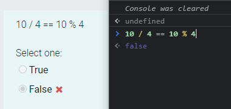

我们应该编写不言自明、易于理解、易于修改或易于扩展新功能的代码。因为代码常常需要被阅读，这就是为什么如此强调干净代码的原因。

我们的源代码可读性越强，则：

- 越容易维护
- 新开发人员理解代码所需的时间越少
- 越容易发现哪些代码可以重用

在这篇文章中，我将分享一些通用的干净编码原则以及一些特定于 JavaScript 的干净编码实践。

## 0. 命名

---

不要把命名变成猜谜游戏。变量和函数的名称最好能够揭示最初创建的意图。

如此一来，即使有新的开发人员加入团队，也不至于需要像看天书一样艰难地理解代码。

> 只有在你希望以后的开发人员需要猜测你现在的想法时，才简写或缩写名称。

Bad 👎

```js
let x = 10;

let y = new Date().getFullYear();

if (x > 30) {
  //...
}

if (y - x > 1990) {
  //...
}
```

Good 👍

```js
let userAge = 30;

let currentYear = new Date().getFullYear();

if (userAge > 30) {
  //...
}

if (currentYear - userAge > 1990) {
  //...
}
```

另外，不要在变量名或函数名中添加多余的不必要的字母。

Bad 👎

```js
let nameValue;
function theProduct();
```

Good 👍

```js
let name;
function product();
```

## 1. 条件句

---

避免否定条件语句。否定语句通常比肯定语句更难理解。

Bad 👎

```js
if (!userExist(user)) {
  //...
}
```

Good 👍

```js
if (userExist(user)) {
  //...
}
```

## 2. 函数应该专注做单一一件事

---

函数的平均行数不应超过 30 行（不包括空格和注释）。函数越小，则越容易理解和重构。你可以用函数修改或查询某些内容，但不能同时修改或查询。

## 3. 使用默认参数

---

使用默认参数而不是短路或条件语句。

默认参数通常比短路更干净。请记住，在你使用默认参数的时候，函数将只为未定义的参数提供默认值。其他虚假值，例如 ''、""、false、null、0 和 NaN，不会被默认值替换。

Bad 👎

```js
function getUserData(name) {
  const userName = userName || "Patrick Collision";
  // ...
}
```

Good 👍

```js
function getUserData(name = "Patrick Collision") {
  // ...
}
```

## 4. 单级抽象（SLA）

---

在编写函数时，如果你有多个抽象级别，那么函数通常会做不止一件事情。将一个大的函数分成多个函数会使其更具可重用性，并且测试起来更容易。

Bad 👎

```js
function checkSomething(statement) {
  const REGEXES = [
    // ...
  ];

  const statements = statement.split(" ");
  const tokens = [];
  REGEXES.forEach((REGEX) => {
    statements.forEach((statement) => {
      // ...
    });
  });

  const names = [];
  tokens.forEach((token) => {
    // lex...
  });

  names.forEach((node) => {
    // parse...
  });
}
```

Good 👍

```js
function checkSomething(statement) {
  const tokens = tokenize(statement);
  const syntaxTree = parse(tokens);
  syntaxTree.forEach((node) => {
    // parse...
  });
}

function tokenize(code) {
  const REGEXES = [
    // ...
  ];

  const statements = code.split(" ");
  const tokens = [];
  REGEXES.forEach((REGEX) => {
    statements.forEach((statement) => {
      tokens.push(/* ... */);
    });
  });

  return tokens;
}

function parse(tokens) {
  const syntaxTree = [];
  tokens.forEach((token) => {
    syntaxTree.push(/* ... */);
  });

  return syntaxTree;
}
```

## 5. 不要忽略被捕获的异常

---

对捕获的异常错误不采取任何措施，即意味着不修复特定的错误也不对其做出反应。

将错误记录到控制台(`console.log`)并没有好多少，因为记录经常会在控制台的其他内容中丢失。

如果你在`try/catch`中包装了哪怕一点点代码，也意味着你认为那里可能会发生错误，因此你应该对何时发生错误有一个计划。

Bad 👎

```js
try {
  functionThatMightThrow();
} catch (error) {
  console.log(error);
}
```

Good 👍

```js
try {
  functionThatMightThrow();
} catch (error) {
  notifyUserOfError(error);
  reportErrorToService(error);
}
```

## 6. 尽量减少注释

---

仅注释具有业务逻辑复杂性的代码部分。

注释不是必需的。好的代码大多数可以自我说明。

Bad 👎

```js
function hashing(data) {
  // The hash
  let hash = 0;

  // Length of string
  const length = data.length;

  // Loop through every character in data
  for (let i = 0; i < length; i++) {
    // Get character code.
    const char = data.charCodeAt(i);
    // Make the hash
    hash = (hash << 5) - hash + char;
    // Convert to 32-bit integer
    hash &= hash;
  }
}
```

Good 👍

```js
function hashing(data) {
  let hash = 0;
  const length = data.length;

  for (let i = 0; i < length; i++) {
    const char = data.charCodeAt(i);
    hash = (hash << 5) - hash + char;

    // Convert to 32-bit integer
    hash &= hash;
  }
}
```

> “多余的注释就是谎言和错误信息的垃圾桶。” ——Robert C. Martin

## 7. 移除注释掉的代码

---

不要在代码库中留下注释掉的代码，版本控制的存在是有原因的。将旧代码留在历史记录中。如果你需要的话，再从 git 历史记录中获取。

Bad 👎

```js
doSomething();
// doOtherStuff();
// doSomeMoreStuff();
// doSoMuchStuff();
```

Good 👍

```js
doSomething();
```

## 8. 只导入你需要的

---

ES6 引入了解构。它可以将数组中的值或对象中的属性解包为不同的变量。你可以将其用于任何类型的对象或模块。

例如，如果你只需要另一个模块中的`add()`和`subtract()`函数：

Bad 👎

```js
const calculate = require("./calculations");

calculate.add(4, 2);
calculate.subtract(4, 2);
```

Good 👍

```js
const { add, subtract } = require("./calculations");

add(4, 2);
subtract(4, 2);
```

只导入需要在文件中使用的函数而不是整个模块，然后从中访问特定函数是有意义的。

## 9. 保持函数参数不超过 3 个（理想情况下）

---

限制函数参数的数量非常重要，因为这样可以更轻松地测试函数。参数超过 3 个会导致需要测试大量不同的情况。

1-3 个参数是最理想的情况，正常情况下，参数数量应避免任何超出此范围。

通常，如果你有三个以上的参数，那么说明函数要做的事情太多了，违反 SRP（单一职责原则）。

## 10. 使用数组展开来复制数组

---

Bad 👎

```js
const len = items.length;
const itemsCopy = [];
let i;

for (i = 0; i < len; i += 1) {
  itemsCopy[i] = items[i];
}
```

Good 👍

```js
const itemsCopy = [...items];
```

## 11. 写线性代码

---

嵌套的代码很难理解。所以我们应该尽可能地编写线性代码，这样的代码简单、干净、易于阅读和维护，使开发人员的工作更轻松。

例如，在回调上使用`promise`可以大大提高可读性。

## 12. 使用 ESLint 和 Prettier

---

始终使用`ESLint`和`Prettier`来强制跨团队和开发人员使用通用的编码风格。

还可以尝试使用 JavaScript 的最新功能来编写代码，例如解构、展开运算符、异步等待、模板字面量、可选链等等。

## 13. 适当使用括号

---

使用运算符时，请将它们括在括号中。唯一的例外是标准算术运算符：`+`、`-` 和 `**`，因为它们的优先级被广泛理解。强烈建议将 `/`、`*` 和 `%` 括在括号中，因为当它们一起使用时，其优先级可能会引起困惑。

这不但提高了可读性，而且阐明了开发人员的意图。

Bad 👎

```js
const foo = (a && b < 0) || c > 0 || d + 1 === 0;

if (a || (b && c)) {
  return d;
}
```

Good 👍

```js
const foo = (a && b < 0) || c > 0 || d + 1 === 0;

if (a || (b && c)) {
  return d;
}
```

确保你的代码不会导致以下情况：



## 14.早早地从函数中返回

---

为避免`if`语句的深层嵌套，始终尽可能早地返回函数的值。

Bad 👎

```js
function isPercentage(val) {
  if (val >= 0) {
    if (val < 100) {
      return true;
    } else {
      return false;
    }
  } else {
    return false;
  }
}
```

Good 👍

```js
function isPercentage(val) {
  if (val < 0) {
    return false;
  }

  if (val > 100) {
    return false;
  }

  return true;
}
```

这个特殊的例子甚至可以进一步改进：

```js
function isPercentage(val) {
  var isInRange = val >= 0 && val <= 100;
  return isInRange;
}
```

同理，同样的事情也可以应用于循环。

大的循环肯定会消耗大量时间。这就是为什么你应该尽可能早地跳出循环。

## 结论

---

开发社区中有一种说法，那就是我们应该在想象下一个开发人员是个连环杀手的鞭策下写代码。

所以，好好学习这 15 个技巧，它们可以帮助你免于受到其他开发人员查看你的代码时会对你造成的伤害哦，哈哈。
