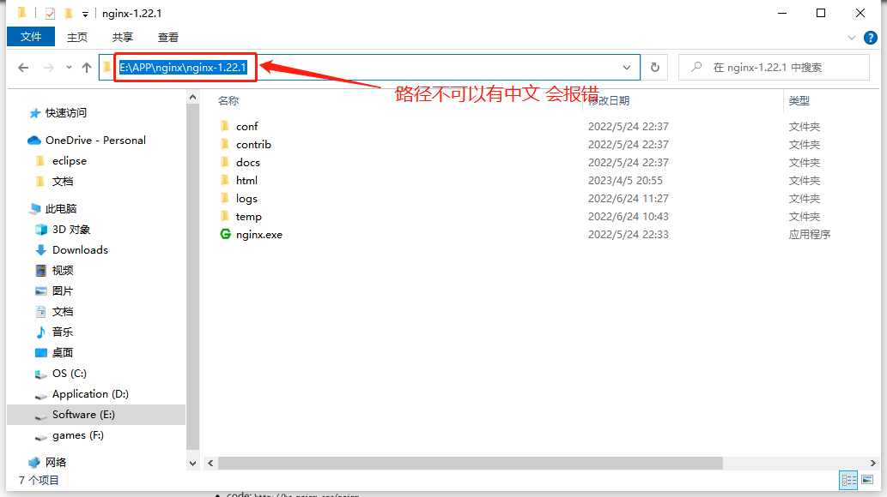

## 1.在 nginx 官网下载稳定版本的 nginx 地址：http://nginx.org/en/download.html 参考下图：

---


## 2.nginx 安装包解压路径中不能含有中文，否则 nginx 启动会报错

---



## 3.使用 npm run build 命令，或者其他自己配置的打包命令将 vue 项目打包，打包完成之后将 vue 项目下生成的 dist 目录拷贝至 nginx/html 目录下

---


## 4.最关键的一步，在 nginx 下的 conf\nginx.conf 中修改 nginx 的配置文件，配置修改如下

---

整理后即为下图所示 ：


[注]: 注意注意：路由配置为 history 时，刷新会出现 404 问题，配置如上图所示即可解决 404 问题


完整原代码：

```
#user  nobody;
worker_processes  1;

#error_log  logs/error.log;
#error_log  logs/error.log  notice;
#error_log  logs/error.log  info;

#pid        logs/nginx.pid;


events {
    worker_connections  1024;
}


http {
    include       mime.types;
    default_type  application/octet-stream;

    #log_format  main  '$remote_addr - $remote_user [$time_local] "$request" '
    #                  '$status $body_bytes_sent "$http_referer" '
    #                  '"$http_user_agent" "$http_x_forwarded_for"';

    #access_log  logs/access.log  main;

    sendfile        on;
    #tcp_nopush     on;

    #keepalive_timeout  0;
    keepalive_timeout  65;

    #gzip  on;

    server {
        listen       8080;			#前端端口号
        server_name  localhost;		#前端服务器地址

        #charset koi8-r;

        #access_log  logs/host.access.log  main;

        location / {
            root   html/dist;		#打包文件存放路径
            index  index.html index.htm;

            try_files $uri $uri/ @router; 	#需要指向下面的@router否则会出现vue的路由在nginx中刷新出现404
            index  index.html;
        }
        location /api/ {
            proxy_pass http://xxxxxxxxxxxxx;	#http://xxxxxxx 这里填上服务器地址
        }

        location @router {
            rewrite ^.*$ /dist/index.html break;
        }

        #error_page  404              /404.html;

        # redirect server error pages to the static page /50x.html
        #
        error_page   500 502 503 504  /50x.html;
        location = /50x.html {
            root   html;
        }

        # proxy the PHP scripts to Apache listening on 127.0.0.1:80
        #
        #location ~ \.php$ {
        #    proxy_pass   http://127.0.0.1;
        #}

        # pass the PHP scripts to FastCGI server listening on 127.0.0.1:9000
        #
        #location ~ \.php$ {
        #    root           html;
        #    fastcgi_pass   127.0.0.1:9000;
        #    fastcgi_index  index.php;
        #    fastcgi_param  SCRIPT_FILENAME  /scripts$fastcgi_script_name;
        #    include        fastcgi_params;
        #}

        # deny access to .htaccess files, if Apache's document root
        # concurs with nginx's one
        #
        #location ~ /\.ht {
        #    deny  all;
        #}
    }


    # another virtual host using mix of IP-, name-, and port-based configuration
    #
    #server {
    #    listen       8000;
    #    listen       somename:8080;
    #    server_name  somename  alias  another.alias;

    #    location / {
    #        root   html;
    #        index  index.html index.htm;
    #    }
    #}


    # HTTPS server
    #
    #server {
    #    listen       443 ssl;
    #    server_name  localhost;

    #    ssl_certificate      cert.pem;
    #    ssl_certificate_key  cert.key;

    #    ssl_session_cache    shared:SSL:1m;
    #    ssl_session_timeout  5m;

    #    ssl_ciphers  HIGH:!aNULL:!MD5;
    #    ssl_prefer_server_ciphers  on;

    #    location / {
    #        root   html;
    #        index  index.html index.htm;
    #    }
    #}

}
```

## 5.conf 配置文件修改之后，可以在 nginx 的安装目录启动 nginx.exe,也可以使用命令，start nginx 启动项目。

---

最后通过配置文件中的前端服务器地址和前端端口访问 vue 项目即可。

常用命令

```
start nginx 启动

nginx -s reload  刷新

tasklist /fi "imagename eq nginx.exe"  查看所有的nginx进程

taskkill /fi "imagename eq nginx.exe" /f  停止所有nginx进程
```
